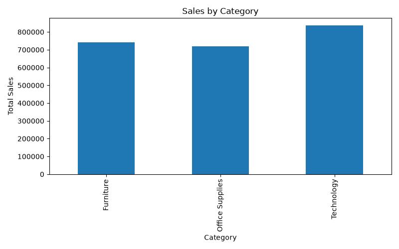
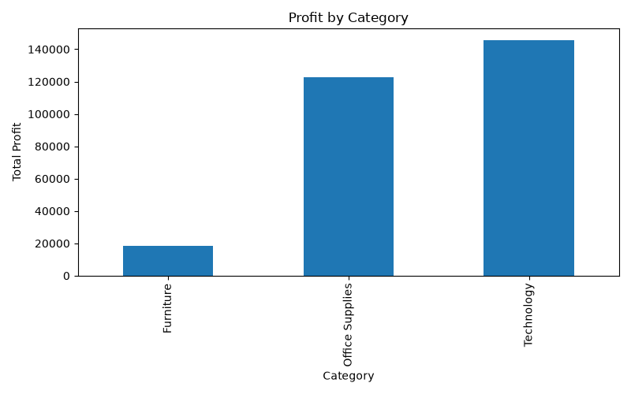
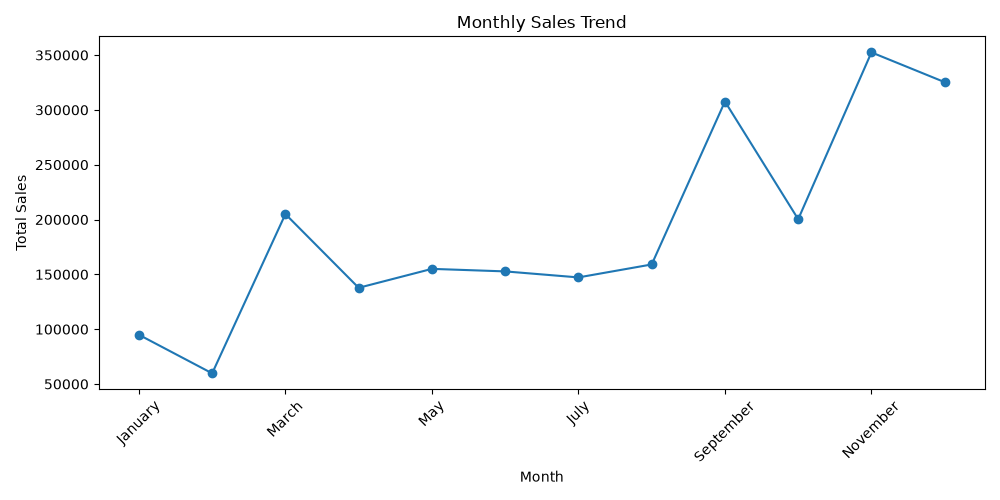

# Vortex Tech Internship - Week 1

# Data Cleaning and Exploratory Data Analysis (EDA)

## Project Overview

This project focuses on cleaning, analyzing, and visualizing the **Sample Superstore dataset** as part of the Vortex Tech Data Science & Analytics Internship.

The objective of this project was to understand raw sales data, perform data cleaning, identify patterns, and generate meaningful business insights using Python and data analysis techniques.

---

## Dataset Information

**Dataset Name:** Sample Superstore Dataset

**Records:** 9,994 rows
**Features:** 21 original columns + 4 engineered features

The dataset contains information about:

* Orders
* Customers
* Products
* Categories
* Sales
* Discounts
* Profits
* Regions

---

## Tools & Technologies Used

* Python
* Pandas
* NumPy
* Matplotlib
* Seaborn
* Jupyter Notebook

---

## Project Structure

```
vortex-internship(data-analyst)

│
├── data
│   ├── sample_superstore.csv
│   └── cleaned_superstore.csv
│
├── notebooks
│   └── Week1_Data_Cleaning.ipynb
│
├── images
│   ├── sales_by_category.png
│   ├── profit_by_category.png
│   ├── monthly_sales_trend.png
│   ├── top_10_products.png
│   └── sales_by_region.png
│
├── README.md
└── main.py
```

---

# Data Cleaning Process

The following preprocessing steps were performed:

### 1. Data Loading

* Imported dataset using Pandas.
* Loaded CSV file into a DataFrame.

### 2. Data Inspection

Performed:

* `head()`
* `info()`
* `describe()`

to understand dataset structure and statistics.

### 3. Missing Values Handling

Checked all columns for missing values.

Result:

```
No missing values found
```

### 4. Duplicate Detection

Checked duplicate records.

Result:

```
No duplicate rows found
```

### 5. Data Type Conversion

Converted:

* Order Date
* Ship Date

from object format into datetime format.

### 6. Feature Engineering

Created new features:

* Order Year
* Order Month
* Order Month Name
* Order Day

---

# Exploratory Data Analysis

## Sales Analysis by Category



### Insight:

* Technology generated the highest sales.
* Furniture and Office Supplies also contributed significant revenue.

---

## Profit Analysis by Category



### Category Performance:

| Category        |      Sales |     Profit |
| --------------- | ---------: | ---------: |
| Technology      | 836,154.03 | 145,454.95 |
| Furniture       | 741,999.80 |  18,451.27 |
| Office Supplies | 719,047.03 | 122,490.80 |

### Insight:

* Technology is the best performing category in terms of both sales and profit.
* Furniture has high sales but comparatively low profit, indicating possible pricing or discount issues.

---

## Monthly Sales Trend



### Insight:

* Sales performance varies throughout the year.
* Monthly trends help identify high-demand periods and seasonal patterns.

---

## Top Customers Analysis

Top customers based on total sales:

| Customer      |     Sales |
| ------------- | --------: |
| Sean Miller   | 25,043.05 |
| Tamara Chand  | 19,052.22 |
| Raymond Buch  | 15,117.34 |
| Tom Ashbrook  | 14,595.62 |
| Adrian Barton | 14,473.57 |

### Insight:

* A small group of customers contributes significantly to total revenue.
* Customer-focused strategies can help increase retention.

---

## Loss Making Products Analysis

Top products generating losses:

| Product                                   |      Loss |
| ----------------------------------------- | --------: |
| Cubify CubeX 3D Printer Double Head Print | -8,879.97 |
| Lexmark MX611dhe Monochrome Laser Printer | -4,589.97 |
| Cubify CubeX 3D Printer Triple Head Print | -3,839.99 |

### Insight:

* Some high-value products generate negative profits.
* Pricing, discounts, and cost management should be reviewed.

---

## Discount Impact Analysis

Correlation between Discount and Profit:

```
Discount vs Profit = -0.219
```

### Insight:

* Higher discounts have a negative impact on profitability.
* Excessive discounting should be optimized to maintain healthy profit margins.

---

# Visualizations Created

The following charts were created:

1. Sales by Category
2. Profit by Category
3. Monthly Sales Trend
4. Top 10 Products by Sales
5. Sales by Region

---

# Key Findings

* Technology category is the strongest revenue and profit contributor.
* Office Supplies provide strong profitability despite lower sales.
* Furniture requires profitability improvement strategies.
* High discounts can negatively affect profit margins.
* Certain products require pricing and cost evaluation.
* Customer analysis helps identify valuable customers.

---

# Conclusion

This project provided practical experience in data cleaning, exploratory data analysis, feature engineering, and visualization.

The analysis transformed raw sales data into meaningful business insights that can support better decision-making.
